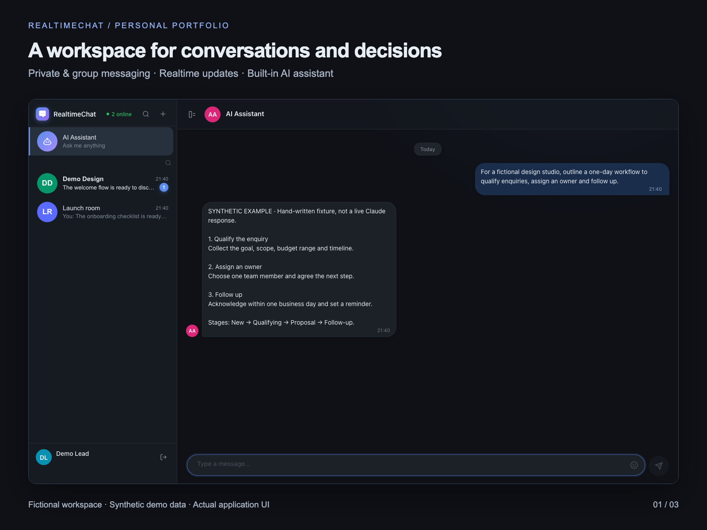
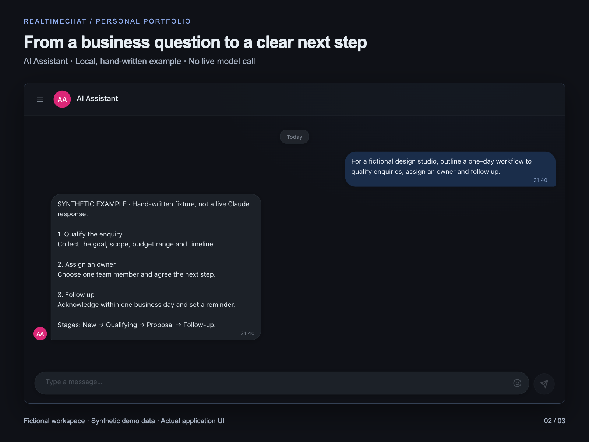
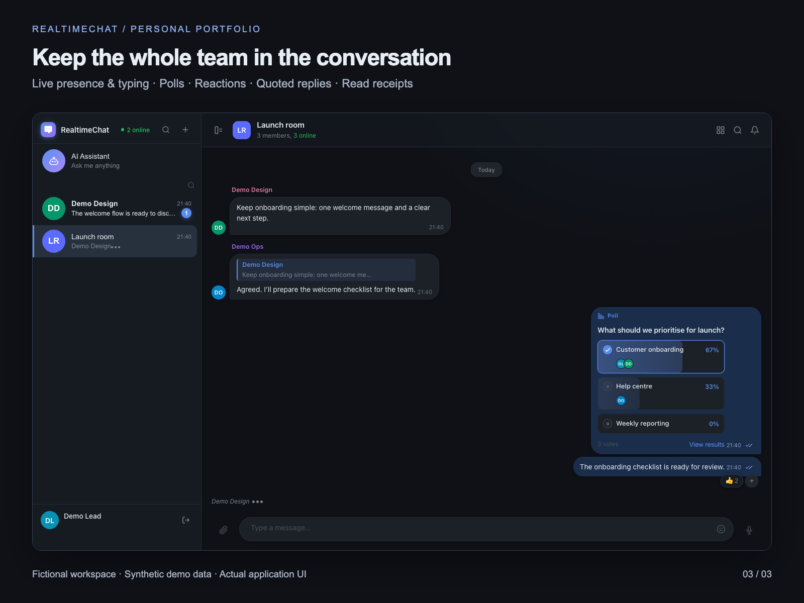

# RealtimeChat

[](https://github.com/voprosovnety/realtime-chat/actions/workflows/ci.yml)

A browser-based messenger with realtime delivery — private and group chats, voice messages,
polls, scheduled messages, media attachments and a built-in AI assistant. Built on Symfony 7
and Vue 3, with a realtime layer on Mercure (SSE).

```
Vue 3 SPA  ──HTTP/JSON──▶  Nginx  ──▶  Symfony 7 / PHP-FPM  ──▶  PostgreSQL 16
     ▲                       │
     └──────SSE──────────────┴──▶  Mercure hub  (chat push updates)
```

| Layer | Technology |
|---|---|
| Backend | Symfony 7 · PHP 8.3 |
| Frontend | Vue 3 · Vite |
| Realtime | Mercure (Server-Sent Events) |
| Database | PostgreSQL 16 |
| Auth | JWT + refresh tokens (rotating) |
| AI | Claude API (Anthropic) |
| Proxy | Nginx |
| Infrastructure | Docker Compose |

---

## Features

**Messaging**
- Private and group chats with roles (owner / member)
- Realtime delivery over SSE, no page reloads
- Delivery and read receipts (✓ / ✓✓), typing indicator, online status
- Quoted replies (click a quote to jump to the original), editing, soft delete
- Emoji reactions, multi-pin, forwarding
- Search: globally across all chats and within a single chat
- Cursor-based history pagination

**Rich content**
- Attachments: multiple files per message — images, video, audio, documents (up to 50 MB)
- Drag-and-drop files into the chat window, paste images from the clipboard
- Fullscreen lightbox with gallery, zoom and panning
- Recording and playback of voice messages (MediaRecorder + custom waveform player)
- Polls: single / multiple choice, anonymous or named, vote retraction
- Scheduled messages with background dispatch

**Platform**
- AI assistant powered by Claude Haiku
- Profile and group avatars with version history
- Responsive layout, mobile gestures (swipe-to-reply, long-press menu), dark theme
- JWT auth with automatic token renewal

---

## Quick start

### Requirements
- Docker with Docker Compose v2
- OpenSSL CLI to generate a local secret

### 1. Configure the environment

From a clean checkout, create the root `.env` with synthetic local settings and a random
Mercure secret. The no-clobber shell option makes the command fail instead of overwriting
an existing `.env`:

```bash
(
  umask 077
  set -C
  { cat .env.example; printf '\nMERCURE_JWT_SECRET=%s\n' "$(openssl rand -hex 32)"; } > .env
)
```

`ANTHROPIC_API_KEY` is optional; the messenger starts without it. Never commit `.env` or
JWT keys. These commands configure a local demo, not a hardened public deployment.

`POSTGRES_DB`, `POSTGRES_USER` and `POSTGRES_PASSWORD` configure PostgreSQL, PHP and the
scheduler together. The entrypoint generates `DATABASE_URL` with URL-encoded components;
use raw values in `.env`, with single quotes around passwords containing `$` or `#`.
Do not set a separate root `DATABASE_URL`. PostgreSQL initialization settings apply only
to a **new** data volume: changing a password in `.env` does not change an existing database
role. Keep the old settings for existing data or migrate credentials deliberately.

If port 80 is occupied, change `NGINX_PORT` and include that port in `MERCURE_PUBLIC_URL`
and `CORS_ORIGINS`.

### 2. Start it

```bash
docker compose config --quiet
docker compose up -d --build
docker compose ps
```

Open `http://localhost` (or the configured port). Production is the default:
`APP_ENV=prod`, `APP_DEBUG=0`, and Composer installs production dependencies only.
No shell `APP_ENV` override is needed. PHP waits for PostgreSQL, generates JWT keys in a
named volume and applies migrations before becoming healthy; the scheduler then starts
without repeating initialization. Uploads and PostgreSQL data also use named volumes.

```bash
docker compose down   # stop the local stack; preserve its data volumes
```

---

## Local development

Use the explicit development override for backend dev dependencies and live source mounts:

```bash
docker compose -f docker-compose.yml -f docker-compose.dev.yml up -d --build
```

The override sets `APP_ENV=dev` and enables debug mode. Source/configuration/migration/template
changes are mounted into the containers; installed dependencies and cache remain in the
containers. Rebuild after changing Composer manifests. Use the same `-f` options with
`exec`, `logs` and `down`. To return to production, stop this stack and use the Quick Start.
The two modes share data volumes within the same Compose project.

For frontend hot reload, install Node.js 24 and use the default Nginx port 80:

```bash
cd frontend
npm ci
npm run dev        # http://localhost:5173
```

Vite proxies `/api` and `/.well-known/mercure` through Nginx at `http://localhost`.
`npm run build` bundles the SPA into `frontend/dist/`. The Docker Nginx image builds its
own frontend assets with `frontend/package-lock.json` and `npm ci`. Backend images install
the exact dependency graph recorded in `backend/app/composer.lock`.

---

## Testing

The standalone test configuration builds a PHP 8.3 target with dev dependencies and the
SQLite extension. It mounts the tracked tests read-only, generates disposable JWT keys,
and forces an in-memory SQLite database. It does not start or connect to the application
PostgreSQL service and requires no root `.env`, API keys, host PHP or host Composer:

```bash
docker compose -f docker-compose.test.yml run --build --rm test
docker compose -f docker-compose.test.yml run --rm test php bin/phpunit tests/Api/MessageApiTest.php
docker compose -f docker-compose.test.yml run --rm test php bin/phpunit --filter testCannotForwardMessageFromChatWithoutMembership
```

Mercure is replaced by `NullHub`; these tests do not cover real SSE delivery or
PostgreSQL-specific queries. PHPUnit is intentionally absent from the production image.
Local `.env.local`, JWT keys, vendor, cache and test artifacts are excluded from build
contexts. Tests and their environment file are mounted only by the test configuration.

### Frontend/browser regressions

```bash
cd frontend
npm ci
npx playwright install --with-deps chromium
npm run test:modeled
npm run test:browser -- --build
```

The focused suite checks login/chat list, send/receive/read receipts over real Mercure,
reconnect, forwarding denial, AI typing and mobile composer/scroll. It runs current frontend
source through Vite against a disposable local PostgreSQL/Mercure stack. Refresh races and
forwarding UI failures are explicitly modeled separately. See [coverage, isolation and
cleanup](scripts/frontend-regressions/README.md); no paid AI or production frontend build
is exercised. CI also runs both sets in a separate browser job.

### Continuous integration

The standalone `CI` workflow runs on pushes and pull requests to `dev` and `main`, and can
also be started manually. It validates workflow files, runs the backend suite and locked
Composer audits, performs a clean frontend `npm ci` and build with npm audits, then exercises
isolated production Compose projects with default and URL-sensitive PostgreSQL credentials.
The Compose smoke verifies real private Mercure/SSE events, read receipts, authorization and
the PostgreSQL-specific `LATERAL` chat list; it also checks cleanup after an injected failure.
CI has read-only repository contents permission and does not consume deployment secrets or
GitHub deployment environments.

The workflow uses `scripts/ci/compose.mjs` as its local/dev/test harness:

```bash
node scripts/ci/compose.mjs backend
node scripts/ci/compose.mjs default
node scripts/ci/compose.mjs custom
node scripts/ci/compose.mjs cleanup-failure   # intentionally exits 42 after successful cleanup
```

Each invocation requires Node.js 24, Docker Compose 2.20+ and a local Unix-socket Docker
engine. It creates an isolated random Compose project, keeps sanitized logs under
`.playwright-mcp/ci-separation/`, and removes its containers, network and volumes. Use
`node scripts/ci/compose.mjs <scenario> --cleanup` if a previous process was interrupted.
Unlike the SQLite/`NullHub` PHPUnit service, the `default` and `custom` scenarios exercise
the production Nginx, PostgreSQL and Mercure stack through HTTP and SSE.

The badge above tracks `main`; inspect the linked GitHub runs for the result on a specific
commit. Local checks alone do not establish a successful remote run.
Deployment is separate and intentionally disabled: `.github/workflows/deploy.yml` is
manual-only and exits without deploying until a separately authorized deployment design is
reviewed. No hosted demo or production deployment is currently claimed.

---

## Demo and deployment limits

This repository is a personal portfolio project and the Quick Start is a local demo, not a
production-ready deployment. In particular, uploaded files are served without per-chat
authorization or lifecycle quotas, refresh/access tokens use browser storage, and enabling
open registration together with the optional AI endpoint would require additional abuse and
cost controls. The floating Mercure image and the disabled deployment workflow also need a
separate operational review before public hosting. `cloud-init.yml` is a disabled reference
template only; fresh-server execution has not been verified.

### Portfolio gallery

These 4:3 captures show the actual interface with a fictional workspace and synthetic
data. The AI conversation is a local, hand-written presentation fixture, **not a live
Claude response**. No client work, production deployment or business results are claimed.







The group state is created through the real API; typing arrives through Mercure.
See [portfolio capture instructions](scripts/portfolio/README.md) for reproducible local
data, browser capture, disclosure details and automatic cleanup.

---

## Project structure

```
.
├── backend/app/
│   ├── src/
│   │   ├── Controller/      # mostly invokable endpoint controllers
│   │   ├── Entity/          # User, Chat, Message, Poll, RefreshToken, …
│   │   ├── Service/         # LinkPreview, PollHelper, ReactionHelper, ScheduledMessageDispatcher
│   │   ├── Security/        # JWT login success handler, user providers
│   │   └── Command/         # app:scheduled-messages:dispatch
│   ├── config/              # security.yaml, packages/, routes/
│   └── tests/Api/           # integration tests
├── frontend/src/
│   ├── views/               # ChatView (main screen), Login, Register, Profile
│   ├── components/          # AudioPlayer, ImageLightbox, PollMessage, EmojiPicker, …
│   ├── composables/         # chat, realtime, scroll and accessibility state
│   ├── api.js               # single HTTP layer with automatic token refresh
│   └── style.css            # design system (CSS tokens)
├── scripts/ci/              # isolated backend and PostgreSQL/Mercure CI harness
├── .github/workflows/       # standalone CI and intentionally disabled deployment
├── docker/nginx/            # reverse-proxy config
├── docker-compose.dev.yml   # development image/source-mount override
├── docker-compose.test.yml  # disposable SQLite/NullHub test service
└── docker-compose.yml       # production-default five-service stack
```

### Services (docker-compose)

| Service | Port | Role |
|---|---|---|
| nginx | 80 | Reverse proxy: SPA, PHP-FPM, Mercure SSE |
| php | — | Symfony 7 / PHP-FPM |
| postgres | internal 5432 | Main database |
| mercure | internal 80 | SSE hub, proxied through Nginx |
| scheduler | — | Background dispatch of scheduled messages (every 30 s) |

---

## Architecture notes

- **Controller boundaries.** Most endpoints use a separate `final` invokable controller;
  a small number of existing auth/profile controllers group closely related actions.
- **Realtime.** Controllers publish events to Mercure on the topics `/chats/{id}/messages`
  and `/users/{id}` (private). The client subscribes via `EventSource` and receives a
  cookie-based subscription to its own chats. Event types: `message.created/edited/deleted`,
  `message.reaction`, `message.pinned`, `poll.voted`, `user.typing`,
  `chat.read/delivered/created/updated`.
- **Auth.** Stateless JWT in the `Authorization: Bearer` header; refresh tokens are stored in
  PostgreSQL with rotation. Login accepts either a username or an email.
- **Pagination.** Keyset cursor `{created_at}|{uuid}`, fetching `limit+1` rows to determine
  `hasMore`.

---

## API

<details>
<summary>Full endpoint table</summary>

| Method | URL | Description |
|---|---|---|
| POST | `/api/auth/register` | Register |
| POST | `/api/auth/login` | Log in (username or email) |
| POST | `/api/auth/refresh` | Refresh token |
| POST | `/api/auth/logout` | Log out |
| GET | `/api/ping` | API health response |
| GET | `/api/me` | Current user |
| PATCH | `/api/me` | Update profile |
| POST | `/api/me/ping` | Update online status |
| GET | `/api/me/avatars` | Profile avatar history |
| DELETE | `/api/me/avatars/{id}` | Delete a history entry |
| GET | `/api/chats` | List chats |
| POST | `/api/chats` | Create a chat |
| GET | `/api/chats/{id}` | Chat details (pins, avatar, members) |
| PATCH | `/api/chats/{id}` | Rename / change avatar |
| DELETE | `/api/chats/{id}` | Delete a chat |
| POST | `/api/chats/{id}/members` | Add a member |
| DELETE | `/api/chats/{id}/members/{uid}` | Remove a member |
| POST | `/api/chats/{id}/leave` | Leave a chat |
| GET | `/api/chats/{id}/messages` | Message history |
| POST | `/api/chats/{id}/messages` | Send a message |
| PATCH | `/api/chats/{id}/messages/{mid}` | Edit |
| DELETE | `/api/chats/{id}/messages/{mid}` | Delete |
| POST | `/api/chats/{id}/typing` | Typing indicator |
| POST | `/api/chats/{id}/pin` | Pin / unpin |
| POST | `/api/chats/{id}/pin-sidebar` | Pin / unpin a chat in the sidebar |
| POST | `/api/chats/{id}/delivered` | Mark chat messages delivered |
| POST | `/api/chats/{id}/read` | Mark chat messages read |
| POST | `/api/chats/{id}/messages/{mid}/reactions` | React |
| GET | `/api/chats/{id}/messages/{mid}/read-by` | Who has read it (groups) |
| GET | `/api/chats/{id}/media` | Chat media gallery |
| GET | `/api/chats/{id}/messages/search` | Search within a chat |
| GET | `/api/chats/{id}/avatars` | Group avatar history |
| DELETE | `/api/chats/{id}/avatars/{aid}` | Delete a history entry |
| POST | `/api/chats/mercure-subscribe` | Subscribe to SSE |
| POST | `/api/chats/{id}/mercure-subscribe` | Subscribe to one chat's SSE topic |
| POST | `/api/chats/{id}/messages/poll` | Create a poll |
| POST | `/api/chats/{id}/messages/{mid}/poll/vote` | Vote in a poll |
| DELETE | `/api/chats/{id}/messages/{mid}/poll/vote` | Retract a poll vote |
| GET | `/api/chats/{id}/scheduled-messages` | List scheduled messages |
| POST | `/api/chats/{id}/scheduled-messages` | Schedule a message |
| PATCH | `/api/scheduled-messages/{id}` | Edit a scheduled message |
| DELETE | `/api/scheduled-messages/{id}` | Cancel a scheduled message |
| GET | `/api/messages/search` | Global search |
| GET | `/api/users/search` | Search users |
| GET | `/api/users/{username}` | User profile |
| GET | `/api/users/online` | Online users |
| GET | `/api/link-preview` | Fetch link-preview metadata |
| POST | `/api/upload` | Upload a file (up to 50 MB) |
| POST | `/api/ai/chat` | AI assistant (Claude Haiku) |
| GET | `/api/doc` | Interactive API documentation |
| GET | `/api/doc.json` | OpenAPI document |

</details>
